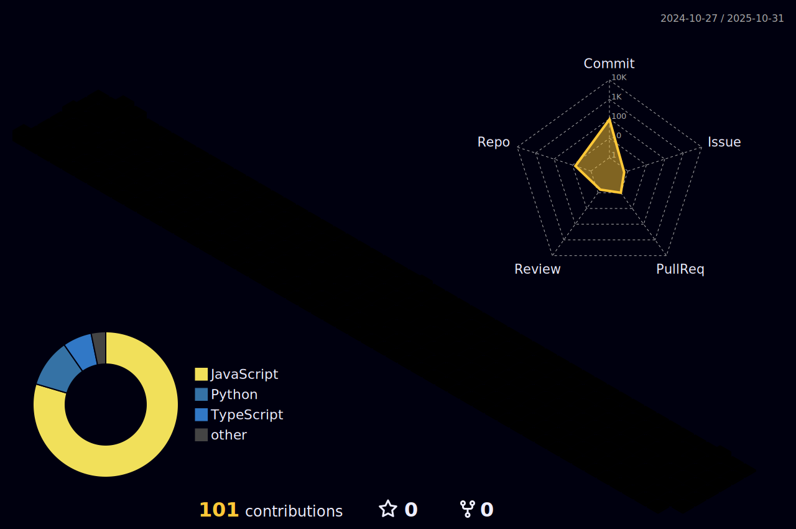

## Sobre mim

- 👨‍💻 Conhecendo novas tecnologias e desenvolvendo aplicações.
- 🎓 Estudando Desenvolvimento de Software Multiplataforma na Fatec Zona Leste.
- 🌱 Procurando aprender sempre mais!
<!-- ### Frameworks -->

## Minhas Skills

## Contato

